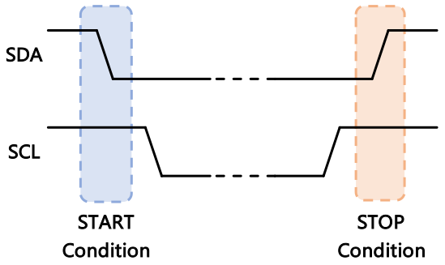
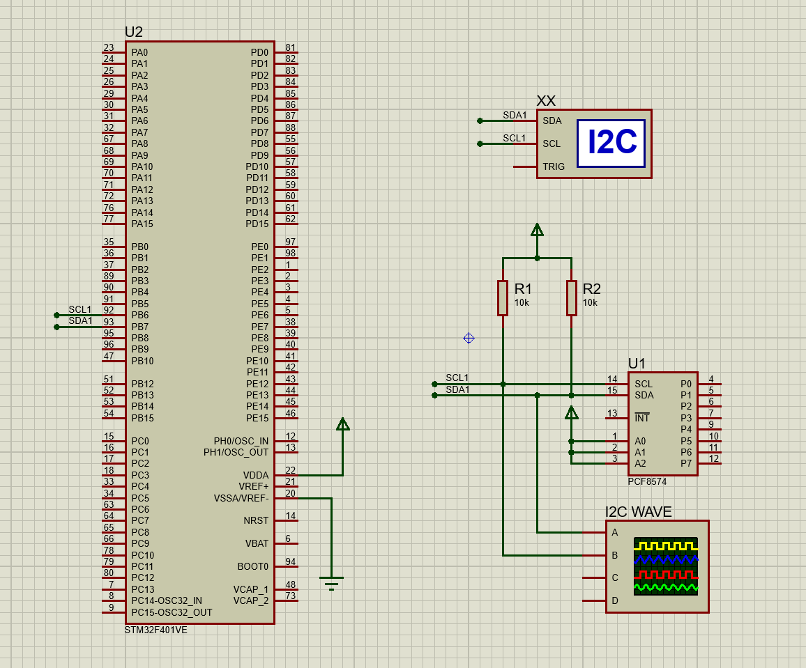
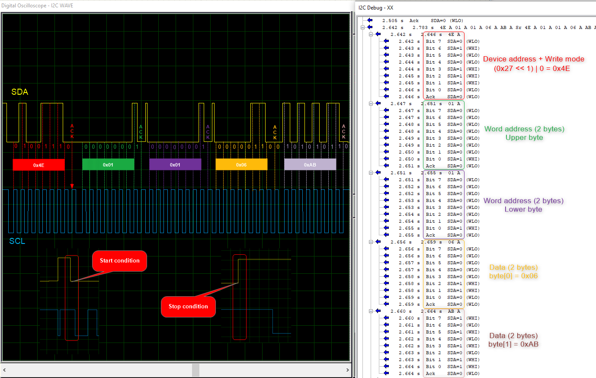

# Soft I2C for STM32F4xx

## Overview

This project provides a **software-based I2C (Soft I2C) master implementation** for STM32F4xx microcontrollers, specifically designed for the STM32F407VGTx (ARM Cortex-M4). It allows I2C communication using general-purpose GPIO pins, emulating the I2C protocol entirely in software. This is useful when hardware I2C peripherals are unavailable, already in use, or when you need to use non-standard pins for I2C communication.

## Features

- **Supports up to 3 I2C buses** with configurable pins:
  - I2C_1: SCL = PB6, SDA = PB7
  - I2C_2: SCL = PB10, SDA = PB11
  - I2C_3: SCL = PH7, SDA = PH8
- **Open-drain output** and **high-speed configuration** for I2C pins.
- **Flexible pin configuration** for both read and write operations.
- **Manual control** of I2C start, stop, ACK, and data transfer sequences.
- **Supports 8-bit and 16-bit addressing** for memory devices.
- **Adjustable timing** for I2C clock speed via software delay (default for 100kHz at 16MHz system clock).
- **Simple API** for reading and writing data blocks to I2C slave devices.

## I2C Data Frame Structure

Below is a diagram illustrating a typical I2C data frame for a write operation (7-bit addressing):

```
| START | 7-bit Slave Address | R/W | ACK | 8-bit Data | ACK | ... | STOP |
    S         A6 ... A0         0     A     D7 ... D0   A          P
```

**Legend:**
- **START (S):** Start condition (SDA goes LOW while SCL is HIGH)
- **Slave Address (A6...A0):** 7-bit address of the slave device
- **R/W:** Read (1) or Write (0) bit
- **ACK (A):** Acknowledge bit from receiver (LOW = ACK, HIGH = NACK)
- **Data (D7...D0):** 8 bits of data
- **STOP (P):** Stop condition (SDA goes HIGH while SCL is HIGH)

## I2C Data Frame Diagram for Memory Device with 16-bit Address

Below is a diagram illustrating a typical I2C data frame for a write operation to a memory device that uses a 16-bit memory address (such as EEPROMs):

```
| START | 7-bit Slave Address | W | ACK | Mem Addr High | ACK | Mem Addr Low | ACK | Data Byte 1 | ACK | ... | Data Byte N | ACK | STOP |
    S         A6 ... A0        0    A        A15...A8     A      A7...A0     A      D7...D0    A         D7...D0    A     P
```

**Legend:**
- **START (S):** Start condition (SDA goes LOW while SCL is HIGH)
- **Slave Address (A6...A0):** 7-bit address of the memory device
- **W:** Write bit (0)
- **ACK (A):** Acknowledge bit from receiver (LOW = ACK, HIGH = NACK)
- **Mem Addr High (A15...A8):** High byte of 16-bit memory address
- **Mem Addr Low (A7...A0):** Low byte of 16-bit memory address
- **Data Byte (D7...D0):** 8 bits of data to write
- **STOP (P):** Stop condition (SDA goes HIGH while SCL is HIGH)

For a read operation, a repeated START is used after sending the memory address, followed by the slave address with the R (read) bit set:

---

> **Tip:**  
> This frame structure is commonly used for EEPROMs and other memory devices that require a 16-bit address field.

---
### Start Condition (START)

The **START condition** signals the beginning of an I2C communication. It is generated by the master device and is recognized by all connected slaves. The START condition is defined as a **high-to-low transition on the SDA line while SCL is high**.

- Before START: Both SCL and SDA are high (bus idle).
- At START: SDA transitions from high to low while SCL remains high.


### Stop Condition (STOP)

The **STOP condition** signals the end of an I2C communication. It is also generated by the master device. The STOP condition is defined as a **low-to-high transition on the SDA line while SCL is high**.


- Before STOP: SDA is low, SCL is high.
- At STOP: SDA transitions from low to high while SCL remains high.





**Summary Table:**

| Condition | SCL | SDA Transition         | Description                        |
|-----------|-----|-----------------------|------------------------------------|
| START     | High| High → Low            | Begin communication                |
| STOP      | High| Low → High            | End communication                  |

These conditions are fundamental to the I2C protocol and must be correctly generated and detected for reliable data transfer.

---
## How It Works

The Soft I2C implementation directly manipulates GPIO pins to generate the I2C clock (SCL) and data (SDA) signals. It follows the I2C protocol sequence, including:

- Initializing GPIO pins for open-drain, high-speed operation.
- Generating start and stop conditions.
- Sending and receiving bytes, including slave address, memory address, and data.
- Handling ACK/NACK bits for communication reliability.
- Switching SDA pin direction between input and output as needed.

---
## API Functions


### Functions

The following table describes the low-level functions provided by the Soft I2C driver. These functions allow direct control over the I2C protocol at the bit and byte level, enabling advanced users to customize or extend the communication process as needed.

| Function Prototype                                             | Description                                                                                   |
|---------------------------------------------------------------|-----------------------------------------------------------------------------------------------|
| `void SoftI2C_Start(uint8_t I2Cx);`                           | Generates an I2C START condition by pulling SDA low while SCL is high.                        |
| `void SoftI2C_Stop(uint8_t I2Cx);`                            | Generates an I2C STOP condition by releasing SDA high while SCL is high.                      |
| `bool SoftI2C_WriteByte(uint8_t I2Cx, uint8_t data);`         | Sends a single byte on the I2C bus and waits for an ACK from the slave. Returns true if ACK received, false otherwise. |
| `uint8_t SoftI2C_ReadByte(uint8_t I2Cx);`                     | Reads a single byte from the I2C bus. The master must send ACK/NACK after reading.            |
| `void SoftI2C_SendACK(uint8_t I2Cx);`                         | Sends an ACK (Acknowledge) bit to the slave after receiving a byte.                           |
| `bool SoftI2C_GetSDA(uint8_t I2Cx);`                          | Reads the current logic level of the SDA line (returns 1 if high, 0 if low).                  |
| `void SoftI2C_SendSlaveAddress(uint8_t I2Cx, uint8_t address, uint8_t modeRW);` | Sends the 7-bit slave address followed by the R/W bit (0 for write, 1 for read).              |
| `void SoftI2C_SendWordAddress(uint8_t I2Cx, uint16_t address);`| Sends the memory word address (8 or 16 bits) to the slave device.                             |
| `void SetPortSDA(uint8_t I2Cx, uint8_t bit);`                 | Sets the SDA pin to logic high or low (bit = SET or CLEAR) for the selected I2C bus.          |
| `void SetPortSCL(uint8_t I2Cx, uint8_t bit);`                 | Sets the SCL pin to logic high or low (bit = SET or CLEAR) for the selected I2C bus.          |
| `void DelayI2CTime(uint16_t time_delay);`                     | Generates a software delay to control the I2C clock speed.                                    |

**Notes:**
- These functions are typically used internally by higher-level API functions, but can be called directly for custom I2C transactions.
- Proper sequencing of START, address, data, ACK/NACK, and STOP is required for successful communication.

### Initialization

```c
void SoftI2C_Init(uint8_t I2Cx);
```
- Initializes the selected I2C bus, configures GPIO pins, and sets SDA/SCL high.

### Write Data

```c
void SoftI2C_WriteData(uint8_t I2Cx, uint8_t Slave_address, uint16_t word_address, uint8_t *data, uint8_t size);
```
- Writes a block of data to a slave device at a specific memory address.
- Sequence:
  1. Initialize I2C bus.
  2. Generate start condition.
  3. Send slave address with write bit.
  4. Send memory word address (supports 16-bit addressing).
  5. Send data bytes.
  6. Generate stop condition.

```c
void SoftI2C_WriteData(uint8_t I2Cx, uint8_t Slave_address, uint16_t word_address, uint8_t *data, uint8_t size)
{
    // 1. Initialize I2Cx to set SDA/SCL pin to HIGH to prepare to start I2C
    SoftI2C_Init(I2Cx);

    // 2. Start I2C
    SoftI2C_Start(I2Cx);

    // 3. Send Slave Address + I2C mode
    if (slave_address_transmited == false)
        SoftI2C_SendSlaveAddress(I2Cx, Slave_address, I2C_MODE_WRITE);

    // 4. Send Word Address
    if (word_address_lower_transmited == false)
        SoftI2C_SendWordAddress(I2Cx, word_address);

    // 5. Write data[size] to slave device at specific address
    for (index_arr = 0; index_arr < size; index_arr++)
    {
        if (!SoftI2C_WriteByte(I2Cx, data[index_arr]))
        {
        };
    }

    // 6. Stop I2C
    SoftI2C_Stop(I2Cx);
}

```

### Read Data

```c
void SoftI2C_ReadData(uint8_t I2Cx, uint8_t Slave_address, uint16_t read_address, uint8_t *data, uint8_t size);
```
- Reads a block of data from a slave device at a specific memory address.
- Sequence:
  1. Initialize I2C bus.
  2. Generate start condition.
  3. Send slave address with read bit.
  4. Send memory word address.
  5. Read data bytes, sending ACK after each byte.
  6. Generate stop condition.

```c
void SoftI2C_ReadData(uint8_t I2Cx, uint8_t Slave_address, uint16_t read_address, uint8_t *data, uint8_t size)
{
    // 1. Initialize I2Cx to set SDA/SCL pin to HIGH to prepare to start I2C
    SoftI2C_Init(I2Cx);

    // 2. Start I2C
    SoftI2C_Start(I2Cx);

    SoftI2C_GPIOConfiguration(I2Cx, I2C_MODE_WRITE);

    // 3. Send Slave Address + I2C mode is READ
    if (slave_address_transmited == false)
        SoftI2C_SendSlaveAddress(I2Cx, Slave_address, I2C_MODE_READ);

    // 4. Send Read Address
    if (word_address_lower_transmited == false)
        SoftI2C_SendWordAddress(I2Cx, read_address);

    SoftI2C_GPIOConfiguration(I2Cx, I2C_MODE_READ);

    // 5. Read each byte data from slave device at specific address and store to address of data array
    for (index_arr = 0; index_arr < size; index_arr++)
    {
        data[index_arr] = SoftI2C_ReadByte(I2Cx);

        // 5.1. Send ACK bit to slave device after reading each byte data to continue reading next byte data
        SoftI2C_SendACK(I2Cx);
    }

    // 6. Stop I2C after reading all data.
    SoftI2C_Stop(I2Cx);
}

```
## Pin Configuration

- **Write mode:** Both SCL and SDA are set as open-drain outputs.
- **Read mode:** SCL is output, SDA is input (open-drain).
- Pin configuration is handled automatically by the driver for each operation.

```c
void SoftI2C_GPIOConfiguration(uint8_t I2Cx, uint8_t modeRW)
{
    switch (I2Cx)
    {
        case I2C_1:
            // Enable Clock for GPIO_B port for I2C1
            RCC_EnablePeripheralClock(CLOCK_GPIO_B);

            // Set Output for SCL pin
            GPIO_Configuration(gpioB_S_i2c, GPIO_PIN6, MODER_OUTPUT, OTYPER_OPENDRAIN, OSPEEDR_HIGH, PUPDR_NOTHING);
            
            // Set Output or Input for SDA pin depending on modeRW (Read/Write)
            if (modeRW == I2C_MODE_WRITE)
                GPIO_Configuration(gpioB_S_i2c, GPIO_PIN7, MODER_OUTPUT, OTYPER_OPENDRAIN, OSPEEDR_HIGH, PUPDR_NOTHING);
            else if (modeRW == I2C_MODE_READ)
                GPIO_Configuration(gpioB_S_i2c, GPIO_PIN7, MODER_INPUT, OTYPER_OPENDRAIN, OSPEEDR_HIGH, PUPDR_NOTHING);
            break;
        case I2C_2:
            // Enable Clock for GPIO_B port for I2C2
            RCC_EnablePeripheralClock(CLOCK_GPIO_B);

            // Set Output for SCL pin
            GPIO_Configuration(gpioB_S_i2c, GPIO_PIN10, MODER_OUTPUT, OTYPER_OPENDRAIN, OSPEEDR_HIGH, PUPDR_NOTHING);
            
            // Set Output or Input for SDA pin depending on modeRW (Read/Write)
            if (modeRW == I2C_MODE_WRITE)
                GPIO_Configuration(gpioB_S_i2c, GPIO_PIN11, MODER_OUTPUT, OTYPER_OPENDRAIN, OSPEEDR_HIGH, PUPDR_NOTHING);
            else if (modeRW == I2C_MODE_READ)
                GPIO_Configuration(gpioB_S_i2c, GPIO_PIN11, MODER_INPUT, OTYPER_OPENDRAIN, OSPEEDR_HIGH, PUPDR_NOTHING);
            break;
        case I2C_3:
            // Enable Clock for GPIO_H port for I2C3
            RCC_EnablePeripheralClock(CLOCK_GPIO_H);

            // Set Output for SCL pin
            GPIO_Configuration(gpioH_S_i2c, GPIO_PIN7, MODER_OUTPUT, OTYPER_OPENDRAIN, OSPEEDR_HIGH, PUPDR_NOTHING);
            
            // Set Output or Input for SDA pin depending on modeRW (Read/Write)
            if (modeRW == I2C_MODE_WRITE)
                GPIO_Configuration(gpioH_S_i2c, GPIO_PIN8, MODER_OUTPUT, OTYPER_OPENDRAIN, OSPEEDR_HIGH, PUPDR_NOTHING);
            else if (modeRW == I2C_MODE_READ)
                GPIO_Configuration(gpioH_S_i2c, GPIO_PIN8, MODER_INPUT, OTYPER_OPENDRAIN, OSPEEDR_HIGH, PUPDR_NOTHING);
            break;
        default:
            break;
    }
}

```

## Timing

- The function `DelayI2CTime(uint16_t time_delay)` creates the necessary delays for I2C timing.
- Default timing is set for a 16MHz system clock and 100kHz I2C speed.
- Adjust `time_delay` if your system clock differs.

```c
void DelayI2CTime(uint16_t time_delay)
{
    for (index_delay = 0; index_delay < time_delay; index_delay++)
    {
    }
}
```

## Example Usage

```c
#include "Soft_I2C.h"

uint8_t write_buffer[2] = {0x06, 0xAB};
uint8_t read_buffer[2];

// Write 4 bytes to slave at address 0x27, memory address 0x0001
SoftI2C_WriteData(I2C_1, 0x27, 0x0001, write_buffer, 2);

// Read 4 bytes from slave at address 0x50, memory address 0x0000
SoftI2C_ReadData(I2C_1, 0x27, 0x0001, read_buffer, 2);
```

## Notes

- Requires `GPIO` and `RCC` drivers for STM32F4xx (included in the project).
- Only master mode is supported.
- Suitable for low to moderate I2C speeds (up to 100kHz).
- For higher speeds or more robust communication, use the hardware I2C peripheral if available.

## Result

Example: Send 2 bytes `data[2] = [0x06, 0xAB]` to slave memory device address: `0x27` at memory address `0x0101`.

- Simulate in Proteus:


- Analyst data result using I2C debugger in Proteus and decode data:


---
## Author
- Nguyen Dinh Thuan (thuan.nd.167@gmail.com)
- Date: 2025-05-26
